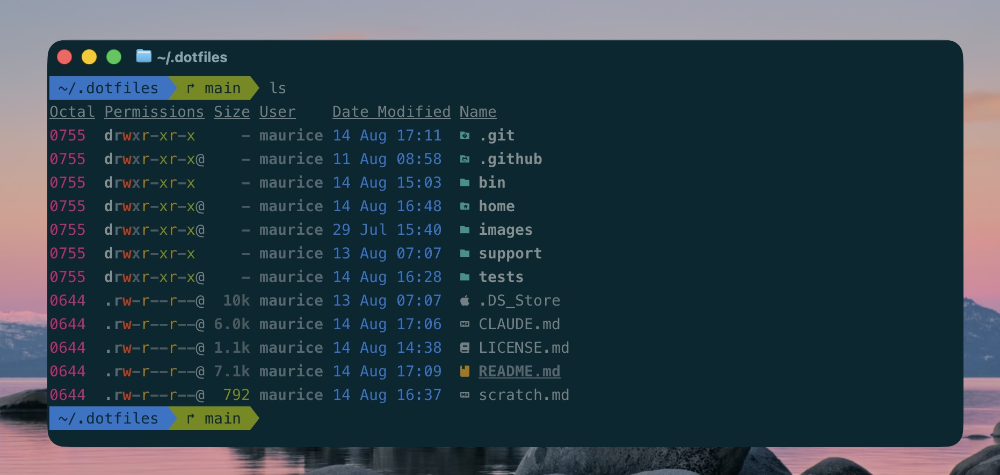

# My Dotfiles

[](https://github.com/moessimple/dotfiles/actions/workflows/tests.yml)



Personal, opinionated dotfiles for Laravel and PHP development on macOS. One script sets up Laravel Herd, Oh My Zsh,
modern command-line tools, macOS preferences, and a version-controlled Claude Code configuration on a fresh Mac.

These dotfiles reflect my personal workflow and are meant to be forked and adapted to your own setup.

## Highlights

- Develop Laravel projects locally with Herd
- Navigate, search, and work faster with Oh My Zsh and modern command-line tools
- Keep Claude Code settings, agents, commands, hooks, rules, and skills version-controlled
- Install, update, and reconfigure the whole setup with one script each

## Requirements

Update macOS via System Settings → General → Software Update.

Install the Xcode Command Line Tools if Git is not available yet:

```zsh
xcode-select --install
```

Generate a GitHub SSH key. Both this repository and tinkerbench are cloned over SSH:

```zsh
ssh-keygen -t ed25519 -C "your@github-email.com"
ssh-add --apple-use-keychain ~/.ssh/id_ed25519
cat ~/.ssh/id_ed25519.pub | pbcopy
```

Add the copied public key at [github.com/settings/keys](https://github.com/settings/keys).

## Before You Install

The installer replaces existing files with symlinks in place; it does not back them up. It also clears five Claude
Code directories under `~/.claude/` (`agents`, `commands`, `hooks`, `rules`, `skills`) before linking them. Review
[`support/setup/clean-state.sh`](support/setup/clean-state.sh) and preserve anything you need there first.

If you fork the repository, adjust these personal defaults first:

- Git identity in [`home/.gitconfig`](home/.gitconfig)
- Absolute working directory in [`home/.config/ghostty/config`](home/.config/ghostty/config)
- Locale and time zone in
  [`support/setup/macos/osx-defaults.sh`](support/setup/macos/osx-defaults.sh), if they don't match yours

The macOS setup enables FileVault and the application firewall, disables hibernation, changes Finder and Dock
behavior, applies German regional settings, and configures several bundled applications. The installer asks for
confirmation before applying these preferences. Review
[`support/setup/macos/osx-defaults.sh`](support/setup/macos/osx-defaults.sh) if you do not want those choices.

## Installation

Clone the repository to the path expected by the scripts and run the installer:

```zsh
git clone git@github.com:moessimple/dotfiles.git ~/.dotfiles
cd ~/.dotfiles
bin/install.sh
```

Follow the prompts and restart the Mac when the installation finishes.

Authenticate GitHub CLI after installation:

```zsh
gh auth login -s user:email -w
gh auth status
```

Choose SSH as the Git protocol during the browser flow.

## What's Included

The complete list of Homebrew formulae, applications, fonts, and Quick Look plugins is in
[`support/config/Brewfile`](support/config/Brewfile). The setup also includes:

- Oh My Zsh, shell aliases, functions, paths, exports, and Git helpers
- Laravel Herd, MySQL, Mailpit, and development applications
- Global Composer and npm tools
- Claude Code configuration, skills, plugins, and MCP servers
- [tinkerbench](https://github.com/moessimple/tinkerbench), installed at `~/Code/tinkerbench`
- Ghostty configuration and macOS preferences

## How It Works

Files under [`home/`](home/) mirror their locations below `$HOME`. For example, `home/.zshrc` is linked to
`~/.zshrc`, and `home/.claude/skills` is linked to `~/.claude/skills`. Editing either path changes the file stored in
this repository.

The managed files cover the shell, Git, Ghostty, and Claude Code. Machine-specific shell configuration that should
not be committed belongs in `~/.extra`.

## Daily Usage

These are the commands I use most often. The full list lives in [`home/.aliases`](home/.aliases),
[`home/.functions`](home/.functions), and [`support/git/`](support/git/).

### PHP and Testing

- `p` runs Pest or PHPUnit.
- `pp` runs the test suite in parallel.
- `pf <filter>` runs tests matching a name.
- `pw` watches files and reruns the test suite.

### Git and GitHub

- `commit [message]` stages and commits the repository. Without a message, Claude generates one or the command asks
  for one.
- `wip` commits everything with the message `wip`.
- `sync` synchronizes long-lived branches from an `upstream` remote and force-pushes them to `origin`.
- `nah` aborts an in-progress Git operation, discards local changes, and removes untracked files.

`sync` and `nah` are destructive commands. Use them only when that behavior is intended.

### Databases and Tools

- `db <refresh|create|drop|list> [name]` manages local MySQL databases.
- `opendb` opens the current project's database in a GUI client, using credentials from its `.env`.
- `mf` / `mfa` fresh-migrates the current project's database, or all of its databases (main, test, and parallel test
  shards).
- `code` opens VS Code.
- `https://tinkerbench.test` runs PHP snippets against Herd-linked projects.

## Maintenance

Update the repository and managed packages with:

```zsh
bin/update.sh
```

Commit or stash changes in `~/.dotfiles` first; the update stops when the repository has a dirty worktree.

The update treats the repository's package and Claude Code declarations as the desired state. It removes undeclared
Homebrew entries, global Composer and npm packages, Claude Code skills and plugins, and user-level MCP servers without
asking. Project dependencies and project-level Claude Code integrations are not affected.

Reapply symlinks, services, Herd and tinkerbench setup, and macOS preferences without reinstalling packages with:

```zsh
bin/reconfigure.sh
```

## Claude Code

Claude Code settings, agents, commands, hooks, rules, and skills live under `home/.claude/` and are linked into
`~/.claude/` during installation.

Third-party skills are managed in
[`support/setup/claude/claude-skills.sh`](support/setup/claude/claude-skills.sh), while plugins and user-level MCP
servers are managed in [`support/setup/claude/claude-plugins.sh`](support/setup/claude/claude-plugins.sh). Run
`bin/update.sh` after changing either file.

## Customization

Use `~/.extra` for machine-specific environment variables, secrets, aliases, or other shell configuration that should
not be committed. Open it with the `extra` alias.

Changes intended for every machine belong in this repository and can be synchronized through Git.

## Tests

Run the repository's Bats tests from the root:

```zsh
bats -r tests/
```

The suite covers the Claude Code quality hooks and selected shell functions.

## Further Documentation

- [Quality Gate Hooks](home/.claude/hooks/README.md)
- [Repository Architecture](CLAUDE.md), for working on this repository with Claude Code

## Credits

Inspired by [Freek Van der Herten's dotfiles](https://github.com/freekmurze/dotfiles) and
[Dries Vints's dotfiles](https://github.com/driesvints/dotfiles), adapted for my own Laravel, Herd, and Claude Code
workflow.
